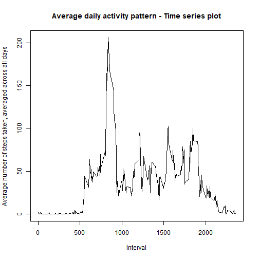
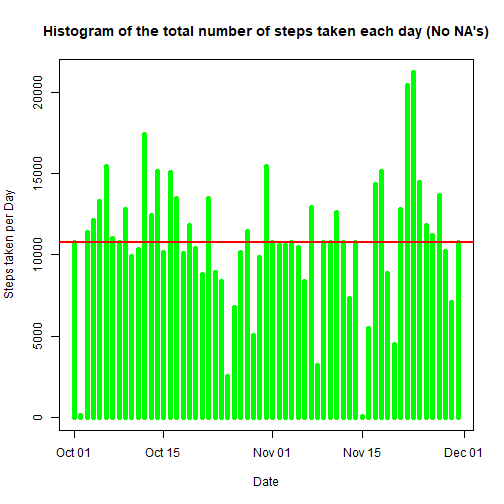
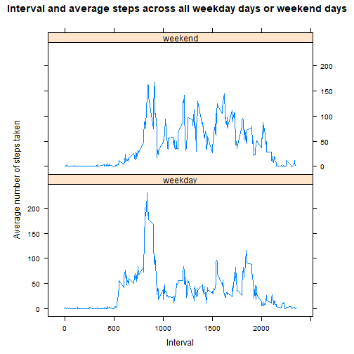

# Reproducible Research: Course Project 1

## Loading and preprocessing the data

Unzipping and reading the data into "amd":

```r
amd <- read.csv(unz("repdata%2Fdata%2Factivity.zip", "activity.csv"), nrows=17568,header = TRUE , sep=",")
```

## The mean total number of steps taken per day


Calculating the total steps for each day:

```r
totalSteps <- tapply(amd$steps, amd$date, sum)
totalStepsDF <- as.data.frame.table(totalSteps)
colnames(totalStepsDF) <- c("date", "steps")
totalStepsDF$date <- as.Date(totalStepsDF$date)
```

A histogram of the total number of steps taken each day including a horizontal line to indicate the mean:

```r
plot(totalStepsDF$date, totalStepsDF$steps, type="h",
     main="Histogram of the total number of steps taken each day",
     xlab="Date", ylab="Steps taken per Day", col="orange", lwd=5)
abline(h  = mean(totalStepsDF$steps, na.rm = T), col = "lightgrey", lwd = 2)
```


The mean and median of the total number of steps taken per day:

```r
theMean <- mean(totalStepsDF$steps, na.rm = T)
theMean
```

```
## [1] 10766.19
```

```r
theMedian <- median(totalStepsDF$steps, na.rm = T)
theMedian
```

```
## [1] 10765
```

##What is the average daily activity pattern?

Make a time series plot of the 5-minute interval and the average number of steps taken, averaged across all days:

first, we calculate the mean steps for each interval

```r
meanStepsInterval <- tapply(amd$steps,amd$interval, mean, na.rm = TRUE)
```

Now we plot:


```r
plot(unique(amd$interval),meanStepsInterval, type = "l", xlab = "Interval",
     ylab = "Average number of steps taken, averaged across all days ",
     main = "Average daily activity pattern - Time series plot")
```



The 5-minute interval, on average across all the days in the dataset, that contains the maximum number of steps:


```r
unique(amd$interval)[which.max(meanStepsInterval)]
```

```
## [1] 835
```

##Imputing missing values

Total number of missing values in the dataset:

```r
sum(is.na(amd))
```

```
## [1] 2304
```

Filling in all of the missing values in the dataset,
Using the mean of each of the 5-minute interval accordingly


```r
amdClean <- amd
meanStepsIntervalRounded <- as.data.frame.table(round(tapply(amdClean$steps,amdClean$interval, mean, na.rm = TRUE)))
colnames(meanStepsIntervalRounded) <- c("interval", "meanSteps")

for(i in 1:nrow(amdClean)){
  if(is.na(amdClean$steps[i]))
    amdClean$steps[i] <- meanStepsIntervalRounded$meanSteps[which(meanStepsIntervalRounded$interval == amdClean$interval[i])]
}
```

Histogram of the total number of steps taken each day for the new dataset that is without NA's:


```r
totalStepsClean <- tapply(amdClean$steps, amdClean$date, sum)
totalStepsDFClean <- as.data.frame.table(totalStepsClean)
colnames(totalStepsDFClean) <- c("date", "steps")
totalStepsDFClean$date <- as.Date(totalStepsDFClean$date)

plot(totalStepsDFClean$date, totalStepsDFClean$steps, type="h",
     main="Histogram of the total number of steps taken each day (No NA's)",
     xlab="Date", ylab="Steps taken per Day", col="green", lwd=5)
abline(h  = mean(totalStepsDFClean$steps, na.rm = T), col = "red", lwd = 2)
```



The mean and median of the total number of steps taken per day for the new dataset:

```r
newMean <- mean(totalStepsDFClean$steps)
newMean
```

```
## [1] 10765.64
```

```r
newMedian <- median(totalStepsDFClean$steps)
newMedian
```

```
## [1] 10762
```

Now we will check the difference:


```r
difMean <- newMean - theMean
difMean
```

```
## [1] -0.549335
```

```r
difMedian <-  newMedian - theMedian
difMedian
```

```
## [1] -3
```

We can see that the mean and median have decreased slightly after replacing the missing values with
the mean of the interval for each day.

## Observing differences in activity patterns between weekdays and weekends

First we add a new variable to the dataset to determine if a given they is a weekday or a weekend day:


```r
amdClean$dayType <- ifelse(weekdays(as.Date(amdClean$date)) == "Saturday" | weekdays(as.Date(amdClean$date)) == "Sunday", "weekend", "weekday")
```

Now we make a panel plot containing a time series plot of the 5-minute interval (x-axis) and the average number of steps taken, averaged across all weekday days or weekend days.


```r
stepsMeanIntervalDay = aggregate(steps~interval + dayType, amdClean,mean)
library(lattice)
xyplot(steps ~ interval | dayType, data = stepsMeanIntervalDay, type="l", aspect = 1/2,
xlab = "Interval", ylab = "Average number of steps taken", main = "Interval and average steps across all weekday days or weekend days")
```


